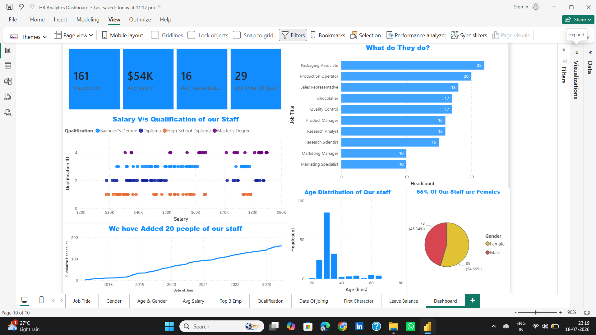

# 📊 HR Analytics Dashboard

An interactive HR Analytics Dashboard built in **Power BI** to analyze workforce performance, employee demographics, salary trends, leave balances, and hiring insights.

---

## 📸 Dashboard Preview

<p align="center">
  
</p>

---

## 🎯 Project Objective

This dashboard helps HR teams and business managers make data-driven decisions by providing insights into:

- Workforce demographics
- Salary distribution
- Employee qualifications
- Leave balance analysis
- Gender diversity
- Hiring trends over time
- Job role distribution

---

## 📌 Key KPIs

- 👥 Total Headcount
- 💰 Average Salary
- 📅 Average Leave Balance
- 📈 Employees with Leave Balance > 20 Days

---

## 📊 Dashboard Insights

- Employee distribution by job role
- Salary vs Qualification analysis
- Age distribution of employees
- Gender ratio
- Cumulative hiring trend
- Qualification analysis

---

## 🛠️ Tools & Technologies

- Power BI Desktop
- Power Query
- DAX
- Microsoft Excel

---

## 📂 Repository Contents

```
📦 HR-Analytics-Dashboard
│── 📄 HR Analytics Dashboard.pbix
│── 🖼️ Dashboard.png
│── 📊 hr-data.xlsx
└── 📄 README.md
```

---

## 🚀 Skills Demonstrated

- Data Cleaning
- Data Modeling
- DAX Measures
- Interactive Dashboard Design
- HR Analytics
- Business Intelligence
- Data Visualization

---

## 👨‍💻 Author

**Anant Sinha**

📌 Aspiring Data Analyst | Power BI | SQL | Python | Excel | Tableau

If you found this project useful, consider giving it a ⭐.
